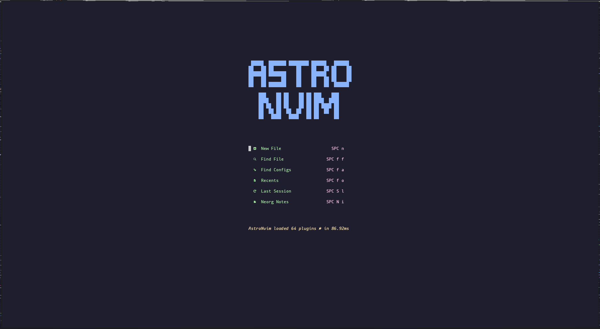
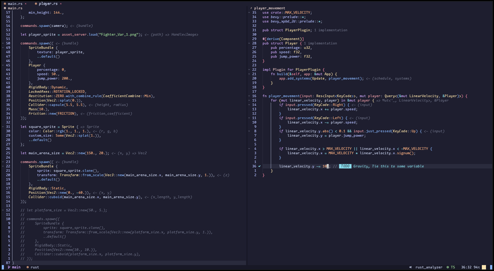
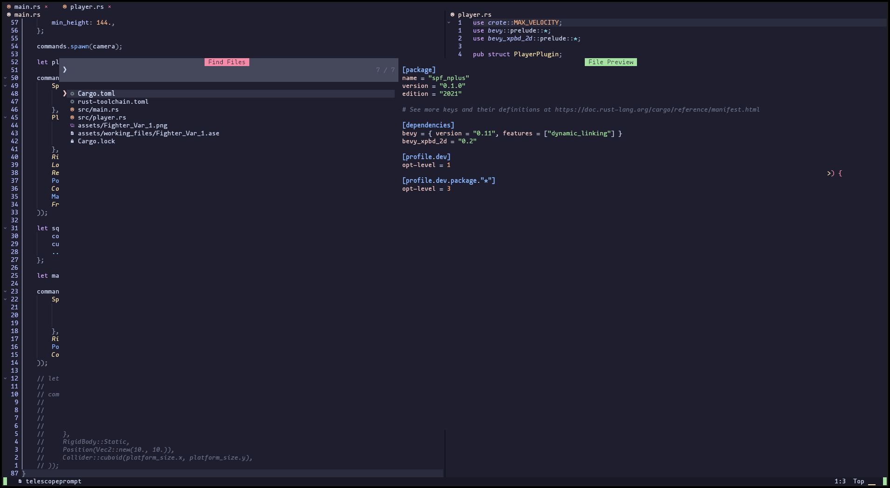
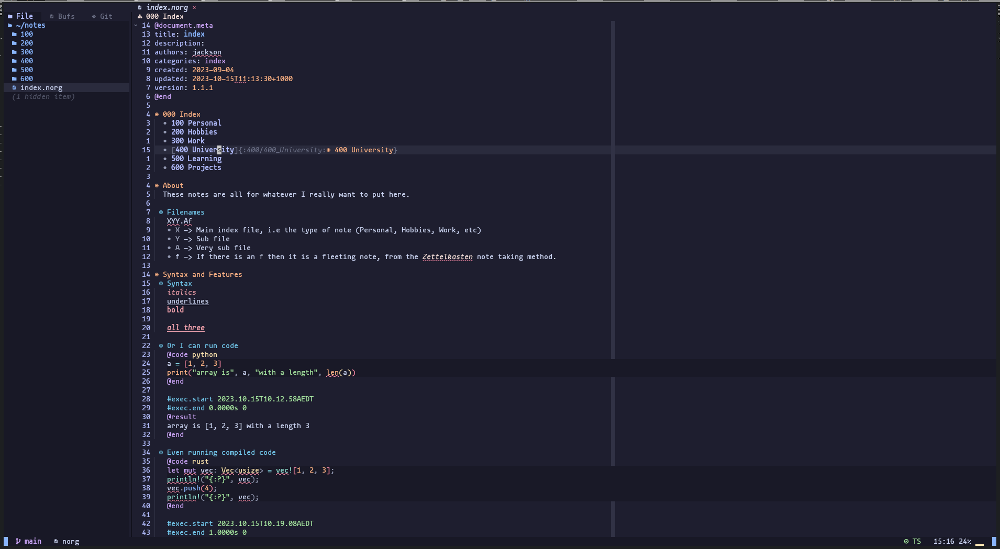

# AstroNvim Configuration (with Colemak Keybinds)
My own (fairly default) configuration of AstroNvim which implements Colemak optimised keybinds from the vim-plug plugin [vim-colemak by Jooize](https://github.com/jooize/vim-colemak).

Other things I did was auto-install language servers for languages I'm often working in and use the [NvChad Telescope Theme snippet](https://astronvim.com/Recipes/telescope_theme) from the [AstroNvim Wiki](https://astronvim.com)

## Gallery
### Editor

### Note Taking
Using the note taking plugin, [Neorg](https://github.com/nvim-neorg/neorg).

